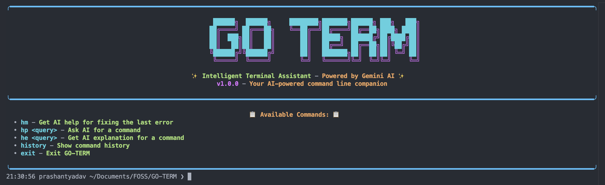

# GO-TERM

<p align="center">
    
</p>

<p align="center">
    <a href="https://github.com/0PrashantYadav0/GO-TERM/stargazers">
        
    </a>
    <a href="https://github.com/0PrashantYadav0/GO-TERM/network">
        
    </a>
    <a href="https://github.com/0PrashantYadav0/GO-TERM/issues">
        
    </a>
</p>

GO-TERM is an intelligent terminal assistant built in Go and powered by Gemini AI. It enhances your command line experience with AI-powered suggestions, error resolution, and command explanations.



## 📖 Table of Contents

- [GO-TERM](#go-term)
  - [📖 Table of Contents](#-table-of-contents)
  - [✨ Features](#-features)
  - [🛠️ Requirements](#️-requirements)
  - [📦 Installation](#-installation)
    - [Option 1: Install from source](#option-1-install-from-source)
    - [Option 2: Install using Go](#option-2-install-using-go)
    - [Option 3: Using Docker](#option-3-using-docker)
  - [Add Gemini API Key ( Very Important )](#add-gemini-api-key--very-important-)
  - [⚙️ Configuration](#️-configuration)
  - [🚀 Usage](#-usage)
    - [Starting GO-TERM](#starting-go-term)
    - [Available Commands](#available-commands)
    - [Chat Feature](#chat-feature)
    - [Clipboard Integration](#clipboard-integration)
  - [📁 Project Structure](#-project-structure)
  - [💾 Files and Configuration](#-files-and-configuration)
  - [🐛 Troubleshooting](#-troubleshooting)
    - [API Key Issues](#api-key-issues)
    - [Display Issues](#display-issues)
    - [Command Execution Problems](#command-execution-problems)
  - [🤝 Contributing](#-contributing)
  - [📄 License](#-license)
  - [👏 Acknowledgments](#-acknowledgments)

## ✨ Features

- 🧠 **AI-powered command assistance** using Gemini API
- 🔄 **Error resolution** - Use AI to fix your last error with a simple command
- 📋 **Clipboard monitoring** - Get command suggestions based on clipboard content
- 📚 **Command explanations** - Get AI explanations for any command or concept
- 💬 **Chat with AI** - Get concise answers to your questions in 3-4 lines
- 🎨 **Beautiful UI** - Colorful terminal interface with animations and spinners
- 📜 **Command history** - Persistent command history with search capabilities
- 💻 **Seamless shell integration** - Works alongside your regular terminal commands

## 🛠️ Requirements

- Go 1.18 or higher
- Gemini API key (obtain from [Google AI Studio](https://ai.google.dev/))
- Git

## 📦 Installation

### Option 1: Install from source

```bash
# Clone the repository
git clone https://github.com/0PrashantYadav0/GO-TERM.git
cd GO-TERM

# Install dependencies
go mod download

# Build the project
go build -o goterm ./cmd/goterm

# Move to your bin directory (optional)
sudo mv goterm /usr/local/bin/
```

### Option 2: Install using Go

```bash
go install github.com/0PrashantYadav0/GO-TERM/cmd/goterm@latest
```

### Option 3: Using Docker

```bash
# Clone the repository
git clone https://github.com/0PrashantYadav0/GO-TERM.git
cd GO-TERM

# Build the Docker image
docker build -t go-term .

# Run GO-TERM in a container
docker run -it --rm go-term
```

## Add Gemini API Key ( Very Important )

To use GO-TERM, you need to set up your Gemini API key. You can do this by creating a JSON file in your home directory.
Create a file named `~/.goterm.json` and add your API key in the following format:

To create the file, you can use the command line:

```bash
touch ~/.goterm.json
```

Then, open the file in your favorite text editor and add the following content:

```json
{
  "gemini_apiKey": "<your_api_key>"
}
```

Alternatively, you can use the command line to create this file:

```bash
echo '{"gemini_apiKey: "<YOUR_API_KEY>"}' > ~/.goterm.json
```

## ⚙️ Configuration

On first run, GO-TERM will prompt you for a Gemini API key. You can obtain one from [Google AI Studio](https://ai.google.dev/).

Your API key will be stored securely in `~/.goterm.json`.

To change your API key later, simply edit this file:

```json
{
  "gemini_apiKey": "YOUR_API_KEY_HERE"
}
```

## 🚀 Usage

### Starting GO-TERM

Simply run:

```bash
goterm
```

### Available Commands

GO-TERM supports all regular shell commands, plus these special commands:

| Command | Description | Example |
|---------|-------------|---------|
| `hm` | Get AI help for fixing your last error | `hm` |
| `hp <query>` | Ask AI for a command | `hp create a zip file of all jpg files` |
| `he <query>` | Get AI explanation for a command or concept | `he what does chmod 755 mean` |
| `chat <question>` | Get a brief AI answer to your question | `chat what is quantum computing?` |
| `history` | Show command history | `history` |
| `exit` | Exit GO-TERM | `exit` |

### Chat Feature

The `chat` command allows you to ask questions and get concise answers from Gemini AI:

```bash
chat what is quantum computing?
```

- Provides brief, informative answers in 3-4 lines
- Displays responses in a nicely formatted box
- Answers are not copied to clipboard or stored
- Perfect for quick information without disrupting your workflow

### Clipboard Integration

GO-TERM monitors your clipboard and suggests relevant commands when you copy:

- GitHub repository URLs → `git clone [url]`  
- npm package URLs → `npm install [package]`
- Homebrew formula URLs → `brew install [formula]`
- Downloadable file URLs → Appropriate download commands

## 📁 Project Structure

```
GO-TERM/
├── cmd/
│   └── goterm/          # Main application entry point
├── internal/
│   ├── ai/              # AI integration with Gemini
│   ├── clipboard/       # Clipboard monitoring functionality
│   ├── terminal/        # Terminal and command handling
│   └── ui/              # User interface components
├── pkg/
│   └── utils/           # Utility functions
├── Dockerfile           # Docker container definition
└── go.mod               # Go module definition
└── go.sum               # Go module dependencies
└── README.md            # Project documentation
└── LICENSE              # License information
```

## 💾 Files and Configuration

- **Command History**: Stored in `~/.goterm_history`
- **Error Logs**: Recent command errors stored in `~/.goterm_error`
- **API Configuration**: Stored in `~/.goterm.json`

## 🐛 Troubleshooting

### API Key Issues

If you encounter problems with your API key:

1. Verify your key is valid in Google AI Studio
2. Check that `~/.goterm.json` contains the correct key
3. Restart GO-TERM after making changes

### Display Issues

If you encounter display issues:

```bash
# Run GO-TERM with TERM environment variable
TERM=xterm-256color goterm
```

### Command Execution Problems

If GO-TERM has trouble executing commands:

1. Try running in simple mode: `NO_COLOR=1 goterm`
2. Check if the command works directly in your regular shell

## 🤝 Contributing

Contributions are welcome! Here's how you can contribute:

1. Fork the repository
2. Create a feature branch: `git checkout -b feature-name`
3. Commit your changes: `git commit -am 'Add some feature'`
4. Push to the branch: `git push origin feature-name`
5. Submit a pull request

## 📄 License

This project is licensed under the MIT License - see the LICENSE file for details.

## 👏 Acknowledgments

- [Gemini AI](https://ai.google.dev/) for providing the AI capabilities
- All contributors and supporters of the project

---

Made with ❤️ by [Prashant Yadav](https://github.com/0PrashantYadav0)
